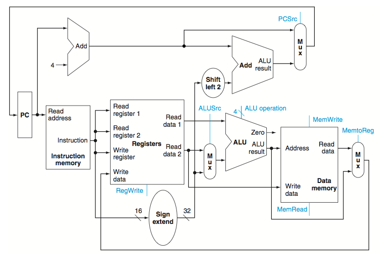

## Datapath

    CPU Time = # of instructions per program x CPI x clock period

Both CPI and clock period are determined by the processor. This note will use a simplified version of process as example. This processor includes 
1. memory-reference: `lw`, `sw`
2. arithmetic-logical: `and`, `sub`, `or`, `and`, `slt`
3. control flow: `beq`, `j`.

### Single-cycle datapath

#### Some conventions

- combinational elements: output depends only on inputs, such as ALU
- state elements: have internal storage and stored states, including registers, memories and data instructions.
- use a _edge-triggered_ strategy as below

It allows one state element be read and written in one same cycle without creating race condition:

#### Build the datapath part by part

The starting steps are the same for any instructions:
1. fetch the instruction from the memory according to `$pc`
2. then increase value fetched from `$pc` by 4 _bytes_, which would be the address for the next instruction
3. store the new value back to `$pc` to get ready for next instruction

- an **Add** unit is built by setting the control line of ALU to always be add operation
- instruction memory is read every cycle

Next, for _R-type_ instructions

- including `add`, `or`, `slt`, etc
- all registers of a processor are stored in a **register** **file**
- any register on the register file could be accessed by specifying a number
- _R-type_: read 2 registers, perform ALU operation on them, and then write the result (either to memory or register)
- inputs needed:
    - read: two inputs of 5-bit to specify register numbers
    - write: one 5-bit specifying register number of the register to be written and one 32-bit input data to write
    - write also needs a `RegWrite` singal to indicate a write operation
    - read does not need any signaling because every clock cycle it will always output whatever content it has
- outputs:
    - read: two 32-bit data
- ALU: it produces a result of 32-bit data and a 1-bit if the result is 0.

_I-type_ instructions,

    lw $t1,offset_val($t2)
    sw $t1,offset_val($t2)

- both compute a memory address by adding the base address `$t2` with a 16-bit offset `offset_val` (_ALU_)
- for `$lw`, write the value read from memory to `$t1` after computing (_register_ _file_)
- or for `$sw`, write the value of `$t1` to the memory (_register_ _file_)
- above operations need the _register_ _file_ and _ALU_ too from the _R-type_ elements
- in addtion
    - sign-extend element: to extend the 16-bit offset to 32-bit for ALU (since it only takes in 32-bit data)
    - a data memory unit of course

as for branch instruction,

    beq $t1,$t2,offset

- 2 5-bit inputs specifying 2 32-bit register values to be compared with, and one 16-bit offset field
- use a _ALU_ with control set as _subtract_ to do the comparison
    - return a 1-bit signal if result is 0
- the offset field has to be extended to 32-bit and then shifted left 2 bits to be turned into a _word_ address (?)
- need a **branch** **control** **logic**
    - if the brank is _taken_, the address of the next instruction is `offset + $pc + 4`
    - else still `$pc + 4`

as for the _jump_ instruction, the operation replaces the lower 28 bits of the result of `$pc + 4` with the lwoer 26 bits of the fetched jump instruction shifted left by 2 bits

#### Implementation

Combine them without any controls first:

Single-cycle: to execute all instructions in one cycle
    - cycle time would be determined by the longest path
    - no resource could be used more than once; possible need for duplication

- use _MUX_ and control signals to select from multiple inputs for different instructions
- incomplete: need **control** **unit**, `j`

Add controls:

- need a **control** **unit** to decide which ALU function needed and which signal should be asserted
- input of **control** **unit**: `funct` and `opcode` fields in the instruction
- need to generate a 4-bit ALU selection based on the 2-bit **ALUOp** control field generated from **control** **unit**

Then we add _MUX_ bits and identify signals:

- `Instruction[31:26]` are the `opcode`
- `Instruction[5:0]` indicates the last 6 bits `funct` field in instruction
- `Instruction[15:0]` indicates the lower 16 bits `offset` field in instruction
- Two regisers needed to be read (`rs` and `rt`) are always `Instruction[25:21]` and `Instruction[20:16]`
- destination register to be written: for `lw` is `rt` (`[20:16]`), for _R-type_ is `rd` (`[15:11]`)
- in total seven 1-bit signals and a 2-bit _ALUOp_ for ALU
- efect of 1-bit signals:

- the setting of control signals is entirely determined by `opcode`
- `funct` and _ALUOp_ determine the ALU action

Now simple datapath with controls AND jump function:

- jump is implemented [TODO:fix]

