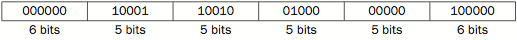
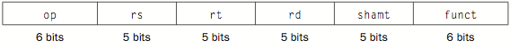
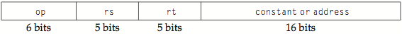
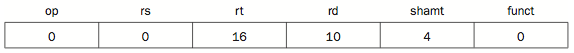

## Instructions

> To communicate with the computer, you have to speak its language

It is called _instructions_.

- vocalbulary: instruction sets
- primitive
- use _MIPS_ as example below

***

### Four prinsciples of hardware design

1. Simplicity favors regularity
2. Smaller is faster
3. Make the common case fast
4. Good design demands good compromises.

***

#### Basics of a line of assembly language

    add a, b, c

- Each line contain only one instruction, which involved exactly 3 variables, no more no less. 
    - (**1**): because hardware design is expensive if it has to deal with various instructions, therefore instructions should be strictly fixed.
- Operands (variables) have to come from special locations built into hardware called _registers_
    - amount of registers a computer has is fixed, mostly 32
    - each register has a size of 32-bit
    - operands stored in the register often called _word_
    - all registers are named as `$xk`, `x` is a character and `k` is a number
    - (**2**): large number of registers would increase clock cycle by longer traveling for eletronic signals

***

#### Memory operand

Registers are limited, but a program might need to access more data than the amount allowed to be stored in registers. Therefore, machine stores data in _memory_ and use _data_ _transfer_ operations to switch them in/out registers. The data in memory is located by their _address_.

- Memory: a large, single-dimension array
- Address: acts as indices to the memory, starting at 0

1. Load/store a word

Say we want to compute following:

    A[12] = h + A[8]

Array `A` is in the memory with starting address stored in register `$t3`. `h` is stored in `$s2`. 

    lw $t0, 32($t3) # reg #t0 gets value of A[8] 
    add $t0, $s2, $t0 # add A[8] and h
    sw $t0, 48($t3) # store the result into A[12] in the memory

- Alignment restriction: in `MIPS`, word must be stored at starting address that are multiple of 4.
- e.g.: `32($t3)` indicates the _8th_ word of array `A`
- `$t0` is a temporary register

2. immediate/constant operands

Operating on constant is a common case (e.g. increment a count), it would inefficient to load/store the constant from/to the memory in each operation. Therefore we introduce special addition operation for constants:

    addi $t3, $t3, 4 # $t3 += 4

(**3**): Reduce the time of common case such as constant operands.

***

#### Machine language

How such instructions are represented in the copmuters? _Not_ string, but _integers_:

A line of instruction such as `add $t0, $s1, $s2` would be presented in decimal:

and in binary form:

- all instructions are exactly 32 bits long (**1**)
- instructions could also be represented by hexdecimal numbers

Fields in an instruction presneted above are defined with their names:

- `op` denotes the operation and format of the instruction (`opcode`)
- `rs`, `rt` and `rd` are registers 1st, 2nd and destination
- `shamt` denotes the amount of shifting if any
- `funct` denotes the specific variant of the operation defined by `op`

However, if say we were to load a word from an array in the memory, to indicate the `shifting` in the index of array, we could only use any one of the registers, which has only 5-bit long. To have longer field for indexing a long array in the memory, we need another format of instruction:

It is called _I-type_ instruction (for immediate), as different from _R-type_ instruction (for registers) in common case. _I-type_ mostly used for immediate or data transfer instructions. In _I-type_ instructions we now have ability to load a constant as large as `2^15`.
- `rt` becomes the destination field
- (**4**) to keep all instructions the same length while providing different functions for different instructions

***

#### Logic operations

Operations on single bit instead of the entire word.

##### 1. Shifting

    sll $t2,$s0,4 # reg $t2 = reg $s0 << 4 bits

- `sll` stands shifting left and `srl` for shifting right. 
- `shamt` is used to store the amount of shifting.
- R-type
- shifting left by `i` bits is the same as multiplying by `2^i`

##### 2. AND operation

    and $t0,$t1,$t2 # reg $t0 = reg $t1 & reg $t2

- used as a mask to hide or filter bits pattern

##### 3. OR/NOR operation

    or $t0,$t1,$t2 # reg $t0 = reg $t1 | reg $t2
    nor $t0,$t1,$t3 # reg $t0 = ~ (reg $t1 | reg $t3)

- used to place a value in to specific "0" bit of a word
- invert bits if we use `nor` with any "0" field
- for both AND and OR we have immediate alternatives `andi` and `ori`

#### Instructions to make decisions

Instructions making decisions based on input data

##### 1. if/else

For a simple condition check:

    if (i == j) 
        f = g + h;
    else 
        f = g – h;

Instructions:

         bne $s3,$s4,Else # go to Else if i != j
         add $s0,$s1,$s2 # f = g + h (skipped if i != j)
         j Exit # go to Exit
    Else:sub $s0,$s1,$s2 # f = g – h (skipped if i = j) 
    Exit:
    
- `beq` and `bne` stand for _branch_ _if_ (_not_) _equal_.
- conditional branches are defined by labels such as `Else`
- `Exit` indicates the end of this condition check
- labels are never wrote explicitly in high-level languages case they should be created in machine languages implicitly

#### 2. for/while loop

A while loop

    while (save[i] == k)
        i += 1;

Instructions:

    Loop:sll $t1,$s3,2 # Temp reg $t1 = 4 * i
         add $t1,$t1,$s6 # $t1 = address of save[i]
         lw  $t0,0($t1)     # Temp reg $t0 = save[i]
         bne $t0,$s5, Exit # go to Exit if save[i] != k
         add $s3,$s3,1 # i = i + 1
         j Loop          # go to Loop
    Exit:

Some special instructions for 2 registers comparison:

    slt $t0, $s3, $s4
    slti $t0, $s2, 10     # $t0 = 1 if $s2 < 10

- put 1 into `$t0` if `$s3` is smaller than `$s4`
- also has a immediate/constant version
