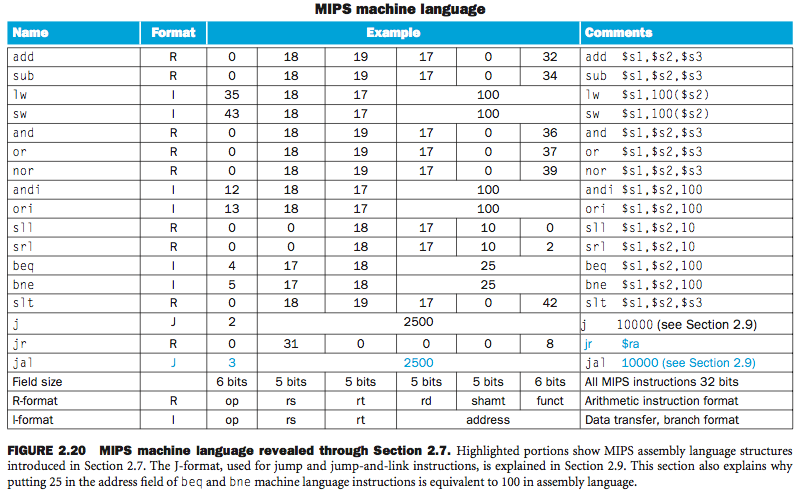

[revisted] Instructions
===

### Machine languages

- 32-bit each
- R-type
    - `op`: the operation and format of the instruction (`opcode`)
    - `rs`, `rt`: 1st and 2nd register source operand
    - `rd`: destination register
    - `shamt`: shift amount
    - `funct`: the specific variant of the operation defined by `op`
- I-type
    - `op` is the same
    - in `sw`: `rs` stores the destination info, `rt` stores value to write
    - in other I-type operand: `rs` stores source operand and `rt` stores address of destination register
- word
    - 32-bit long, could be the data stored in register, an MIPS instruction
    - alignment restriction: in memory the address of storing each word must start with a multiple of 4 (0, 4, 8, 12...)
- register in a processor
    - 32 in MIPS, 32-bit in size
    - `$t0`-`$t9`: 10 temporary registers that do not need to be preserved
    - `$s0`-`$s7`: 8 saved registers that need to be preserved in a procedure call
    - `$a0`-`$a3`: registers to pass argument parameters for procedure call
    - `$v0`,`$v1`: registers used to return values from a procedure
    - `$ra`: register storing address of caller