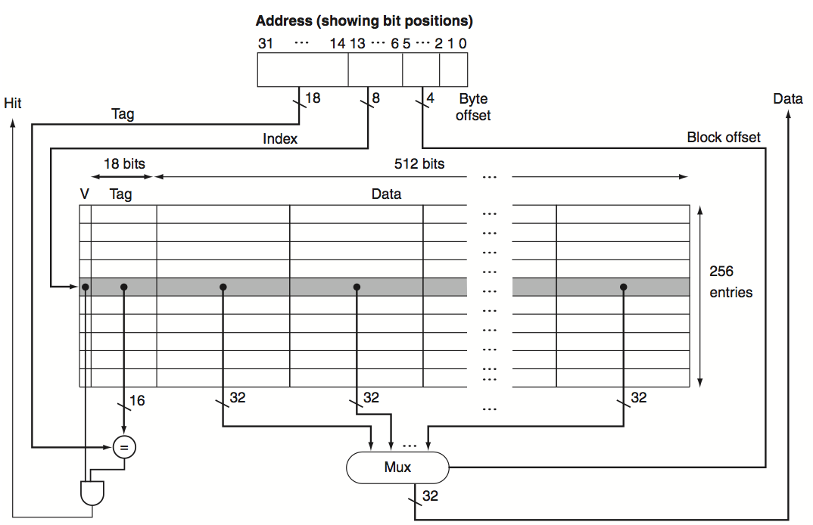
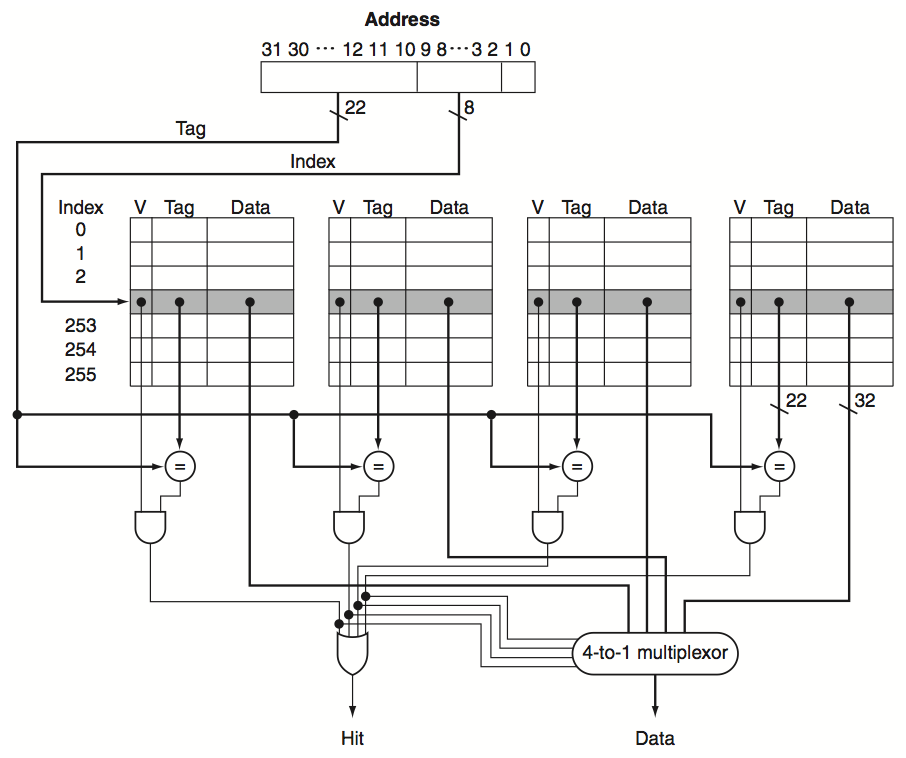
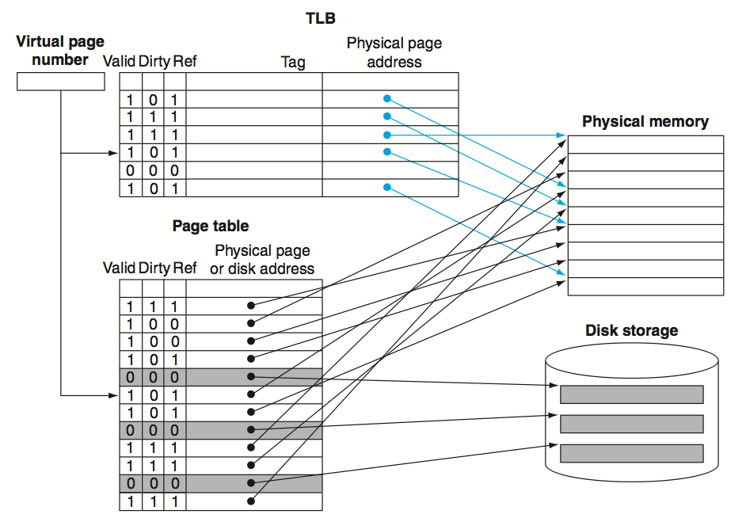
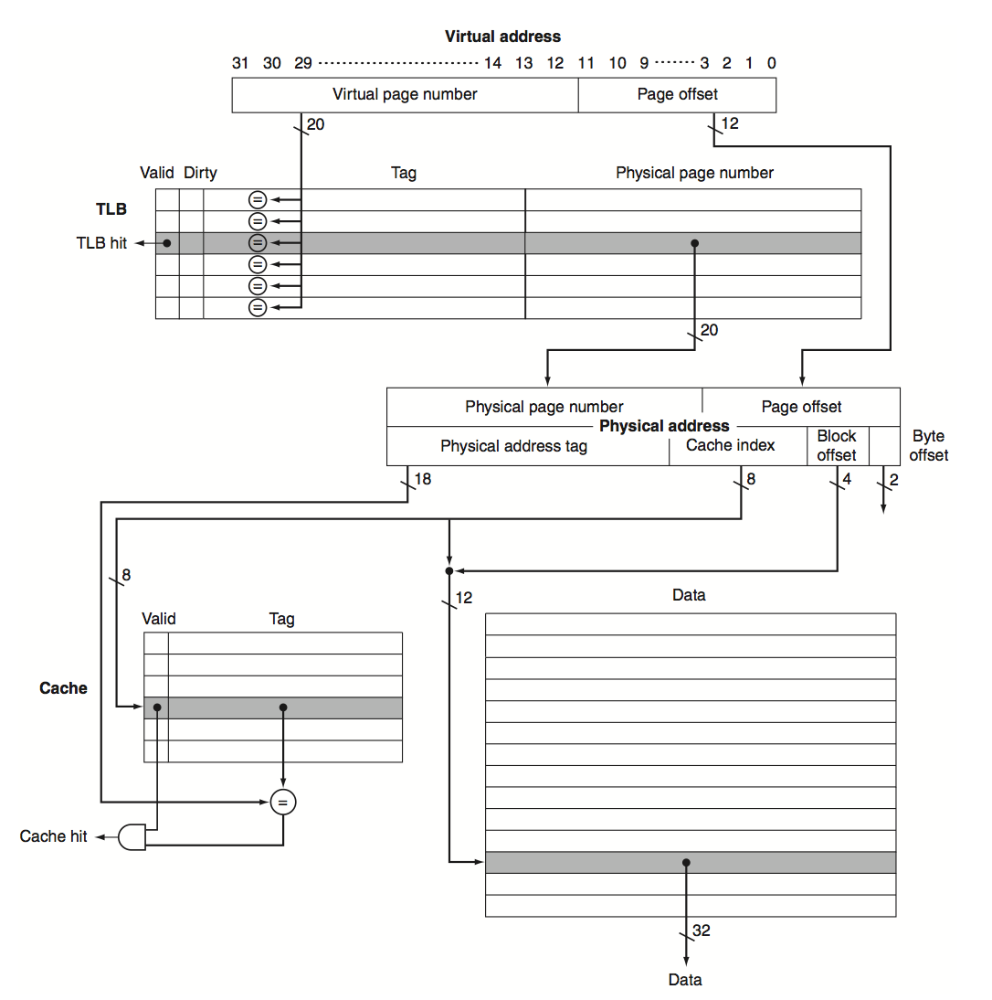

Memory
=====

Hierarchical memory design that takes advantage of _principle_ _of_ _locality_ in programs:

- Temporal locality: a data location is referenced before tends to be referenced again soon. Example: loops.
- Spatial locality: a datalocation is referenced, nearby address will tend to be referenced soon. Example: sequential program.

Multiple levels of memory:

- Cache: fastest, smallest, SRAM
- Main memory: DRAM
- Disk: magnetic disk, slowest

As for the performance of a memory implementation, we focus on **hit** **rate** and **miss** **penalty**.

- hit time: time to access upper lvel of memory and time to determine whether the access is a hit or miss
- miss penalty: time to replace a block in upper level with one from lower level, and time to deliver it to the processor

### Caches

The level of memory between processor and main memory.

#### Structure

direct-mapped

- no sets, each block could only end in one place 
- `(block address) mod (# of cache blocks in the cache)`
- `index` identifies the block
- check the validity bit to see if any data present
- `tag` checks if the address is correct
- `block offset` selects the word we want from the block

k-way associative/fully associative

- store k blocks per set
- each block has k places to put
- `(block address) mod (# of sets in the cache)`
- all tags of all elements of a set must be searched
- in fully associative, `# of sets = 1`
- extra cost of comparators and delay caused by them and element selection
- `index` identifies the set
- search all `tag` in the set to find the matching one
- select the word we want if `block set` presents

#### Cache misses

1. `$pc –= 4`
2. **read** from main memory and wait for the data (_stall_)
3. **write** the cache entry: data from memory => data portion, upper bits of address (from ALU) to `tag`, write validity bit on
4. fetch and restart the original instruction

##### how to write

- write-through
    - always write the data into both memory and cache
    - avoid inconsistency
    - writing to memory is _slow_ and _expensive_
    - remedy: write buffer
        - do not write to memory, but to buffer
        - then execute as normal
        - writing to memory happens separately
        - have to stall if the buffer is full
- write-back
    - new value is written only to the cache
    - then the modified block is written to lower level (e.g. memory) when it is replaced

### Virtual memory

> VM to memory as memory to cache

- VM stores unused memory of a program on _disk_, and swap it with ones in main memory when necessary
- allow sharing of memory among programs
    - only a fraction of memory is used at any time given a program
    - actual resource of a program could exceed the limit of memory

#### General structure

- **page** is a block of virtual memory identified by a **virtual address**
    - a **page fault** is a virtual memory miss
    - to access the actual page, we **translate** the given virtual address to physical address, and find the page accordingly
- **page table** is in _memory_ and stores mappings from every virtual address to physical address
    - each program has its own page table
    - a **page table register** points to the start of the page table
    - `valid` bit in page table entry tells if the page is present in main memory of not
    - `dirty` bit tells whether the page has been written => do not write to disk if has not been changed
    - no `tag` required because the table contains mapping for every possible page 
    - **swap space** is on the disk and stores all pages of all processes
    - **copy back** happens when trying to write a page into disk
        - perform writes into the page in memory
        - copy the page in memory back to disk when it is replaced in memory
- **TLB** (translation-lookaside buffer) is in _cache_ and stores recently used maping of virtual address => physical address
    - memory access is slow in 2 steps
        - access memory to obtain physical address of a page
        - obtain the data from memory
    - TLB stores recently used mapping to skip the first step
    - TLB miss happens more than page fault 
    - most TLBs are small fully associative to minimize miss rate

- **virtual address** contains `virtual page number` and `page offset`
- [TLB hit] find the `physical page number` in TLB
    - one-bit `valid` is on
    - `virtual page number` matches `tag`
    - `reference` bit is turned on
    - if it is a **write**, `dirty` bit is also turned on
- [TLB miss]
    - load mapping for wanted page from memory and try again
    - [page fault] wanted page is not in memory
        - raising an exception
        - follows **LRU** (least recently used) replacement scheme
        - write the replaced page back to swap
    - which entry to be replaced: randomly choose mostly
    - [write-back] replace an entry on TLB, copying it along with all bits back to memory
