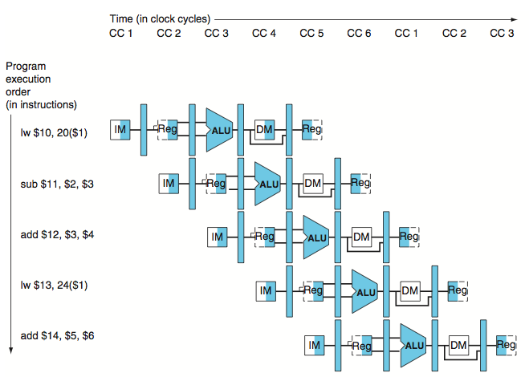
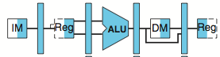
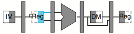
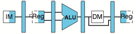
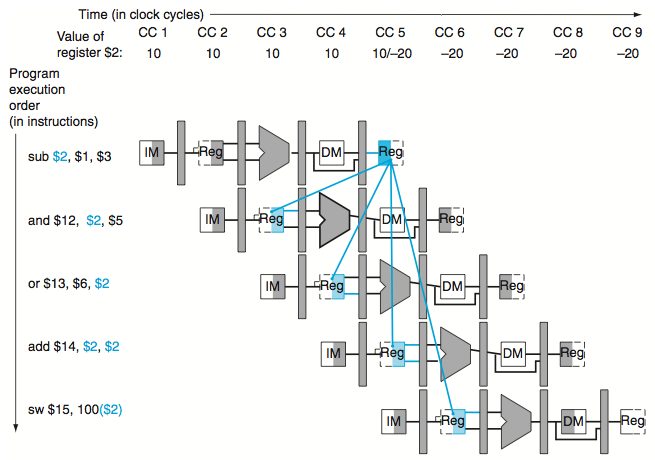

Pipelining
========

> Parallelism

Pipelining is an _implementation_ technique to alow multiple instructions overlapped (i.e. executed at the same time). It makes processor fast by increasing its throughput. Note the actual time to complete single instruction does not change.

We splits MIPS instructions into 5 stages. Theoretically a full pipe could make the processor _five_ times faster. However in reality it is just closer to five when pipe gets longer. 

Hazards in pipelining include:

1. Structural hazards: the hardware cannot support the combinations of instructions we want in the same cycle
    - can a single unit be shared in the same cycle?
    - MIPS has two memories?
2. Data hazards: one step must wait for another to complete (wait for data mostly)
    - resolved by _forwarding_: forward the data needed directly to next instruction without putting it into reg
    - graphical representation of different MIPS instructions
3. Control hazards: make a decision based on the results of one instruction while others are executing
    - mostly for branching
    - solution one: stall - too slow
    - solution two: branch prediction
        - always predict to be one branch, or
        - _dynamic_ prediction: based on the past history
    - solution three: delay decision
        - execute some other instructions (say next sequetional instruction)
        - then execute branch one
        - MIPS acutally use this

### Representation of pipeline

***

**Five-stage** of an instruction

1. IF: Instruction Fetch
2. ID: Instruction decode and register file read
3. EX: Execution or address calculation
4. MEM: Data memory access
5. WB: Write back

#### Pipeline diagram

- each stage is represented by its physical resources used
    - IM: **IF** from instruction machine
    - Reg: **ID** reads from register
    - ALU: **EX** using Algebraic logic unit
    - DM: **MEM** read/write to data memory
    - Reg: **WB** write data back to register
- each stage, _write_ in 1st half, _read_ in 2nd half
    - this enables read and write in the same cycle
- between each pair of two adjcent stages there is a pipeline register
    - any information in later stage must be passed to that stage via a pipeline register
- no write signal for either PC or any pipeline register
    - they are written on each clock cycle

diagram of `lw $1, 100($0)`,

1. **read** instruction from meory using `$pc`, place it in IF/ID register
2. decode the instruction, get register numbers, **read** two registers, pass results and a extended 32-bit immediate to ID/EX register
3. adds immediate and value of register `$0`, put the sum into EX/MEM register
4. **read** from memory using data from EX/MEM register, then place data into MEM/WB register
5. **write** the data to register (`$1`)

diagram of `sw $15, 100($2)`,

1. Same as `lw`: **read** instruction
2. Same as `lw`: decode and **read** register files
3. calculating memory address and put it to EX/MEM register
4. **write** data to target memory address
5. NOTHING happens here.

diagram for `add`, `sub`, `or`, `and` are similar,

- no memory access
- in 5th stage, **write** the result into target register

### Data hazards and Forwarding

***

An example,

- last 4 instructions all depend on the result in `$2`, which is calculated by the 1st instruction.
- but only 2nd and 3rd instructions create data hazard
- only focus on forwarding to an operation in the **EX** stage

#### detection of a data hazard

In the graph above, the 1st hazard occurs when `sub` is in MEM stage and following `and` is in EX stage at register `$2`:

    EX/MEM.RegisterRd = ID/EX.RegisterRs = $2

This is the detection rule of this type of hazard. A list of similar rules:
    
    EX/MEM.RegisterRd = ID/EX.RegisterRs 
    EX/MEM.RegisterRd = ID/EX.RegisterRt
    MEM/WB.RegisterRd = ID/EX.RegisterRs 
    MEM/WB.RegisterRd = ID/EX.RegisterRt

Note this is only accurate when the instruction needs to write registers, therefore `RegWrite` should be asserted. Also, weird rule of `$0` [TODO] indicates that do not forwarding if the destination register is `$0`. We summarize three rules as following condition:

    if (EX/MEM.RegWrite
    and (EX/MEM.RegisterRd != 0)
    and (EX/MEM.RegisterRd = ID/EX.RegisterRs)) ForwardA = 10

    if (EX/MEM.RegWrite
    and (EX/MEM.RegisterRd != 0)
    and (EX/MEM.RegisterRd = ID/EX.RegisterRt)) ForwardB = 10

- `ForwardA` and `ForwardB` are control bits for 2 MUX of forwarding. `01` selects forwarding values from EX/MEM.
- Such condition detection is applied only for first 2 rules (EX hazards)

As for MEM hazards, it occurs when a sequence of instructions will all read and write the same register, making values at MEM stage to be the most recent values

    if (MEM/WB.RegWrite
    and (MEM/WB.RegisterRd != 0)
    and (EX/MEM.RegisterRd != ID/EX.RegisterRs)
    and (MEM/WB.RegisterRd = ID/EX.RegisterRs)) ForwardA = 01

    if (MEM/WB.RegWrite
    and (MEM/WB.RegisterRd != 0)
    and (EX/MEM.RegisterRd != ID/EX.RegisterRt)
    and (MEM/WB.RegisterRd = ID/EX.RegisterRt)) ForwardB = 01

- MEM stage is the _most_ recent
    - it is different from EX/MEM values
- an example would be summing a vector of numbers into a single register
- `01` selects forwarding values from MEM/WB

### Data hazards and stall

***

Occurs when one instruction tries to read a register after a load instruction writes the same register. The read instruction has to wait.

    if (ID/EX.MemRead and
        (
            (ID/EX.RegisterRt = IF/ID.RegisterRs) or
            (ID/EX.RegisterRt = IF/ID.RegisterRt)
        )
       )
        stall the pipeline

- `MemRead` should be asserted since only `lw` will read the memory
- 2nd and 3rd lines check if the destination EX tries to write to is the target the next instruction tries to read from
- stall is impelemented by `nop` signal that deasserting all 9 control signals
    - no written if all `0`
    - a MUX added after the control unit to select the normal control bit or all `0`s

### Branch hazards

***

The decision of a branch instruction like `beq` would not occur until its MEM stage, forcing the next instruction to wait until then. 2 ways of solving it:

#### Always assume branch not taken

- assume not taken, continue sequentially in instructions
- if wrong, 
    - zero all control bits (like a _stall_)
    - flush instructions in IF, ID and EX stages
    - change `$pc`?
- then take the branched instruction
    - how?
- if the probability of untaken is 0.5, we reduce half of the cost of control hazard.

#### Dynamic prediction

Have a history record of the decision on each branch, predict the current one based on history.

- deeper piplines increase branch penlty
- a branch predction buffer
- 1-bit prediction scheme
    - store whether branch is taken last time
    - we assume it is the same as the last one
    - example: a loop that branches 9 times in a row, and then untaken for once
        - the first and last would definitely be wrong
        - 80% accuracy for a branch taken 90% of the time
- 2-bit prediction scheme
    - change the buffer only if predict wrong twice in a row

[TODO: delay]
