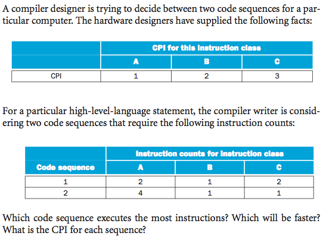
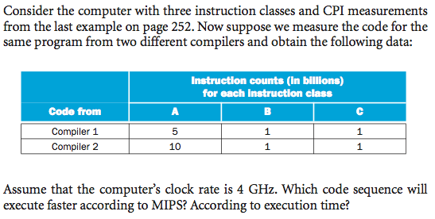

Performance
=====

Q

Do the following changes to a computer system increase throughput, decrease response time, or both?

1. Replacing the processor in a computer with a faster version
2. Adding additional processors to a system that uses multiple processors for separate tasks—for example, searching the World Wide Web.

ANS

1. decrease response time, also increasing throughput
2. increase throughput

Q

Our favorite program runs in 10 seconds on computer A, which has a 4 GHz clock. We are trying to help a computer designer build a computer, B, that will run this program in 6 seconds. The designer has determined that a substantial increase in the clock rate is possible, but this increase will affect the rest of the CPU design, causing computer B to require 1.2 times as many clock cycles as computer A for this program. What clock rate should we tell the designer to target?

ANS

Since,

> CPU_Time = #_of_clock_cycle / clock_frequency

Therefore for `A`,

    #_of_clock_cycle_A = clock_freq_A x CPU_Time_A = 4 x 10^10

For `B`,

    CPU_Time_B = 1.2 x #_of_clock_cycle_A / desired_clock_freq_B = 6
    desired_clock_freq_B = 1.2 x #_of_clock_cycle_A / CPU_Time_B
                         = 1.2 x 4 x 10^10 / 6
                         = 8 GHz

Q

Suppose we have two implementations of the same instruction set architecture. Computer A has a clock cycle time of 250 ps and a CPI of 2.0 for some program, and computer B has a clock cycle time of 500 ps and a CPI of 1.2 for the same program. Which computer is faster for this program, and by how much?

ANS

> CPU_Time = CPI x #_of_instructions x clock_cycle

Therefore,

    CPU_Time_A = 2.0 x N x 250 = 500N
    CPU_Time_B = 1.2 x N x 500 = 600N

`A` is 1.2 times faster.

Q

ANS

    #_of_instructions_1 = (2*1 + 1*2 + 2*3) = 10
    mean_CPI_1 = (2*1 + 1*2 + 2*3)/5 = 2
    #_of_instructions_2 = (4*1 + 1*2 + 1*3) = 9
    mean_CPI_2 = (4*1 + 1*2 + 1*3)/6 = 1.5

Code sequence `1` has most instructions. `2` would be faster.

Q

ANS

    clock_cycle = 1 / clock_freq
    exec_time = #_of_instructions x CPI / clock_freq
    MIPS = #_of_instructions / (exec_time x 10^6)

- Execution time 1 is `2.5s` and 2 is `3.75s`. 1 is faster.
- MIPS 1 is 2800 and 2 is 3200. 2 is faster!
